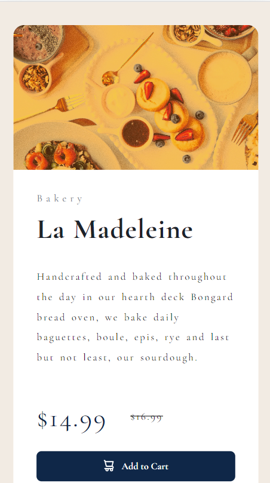
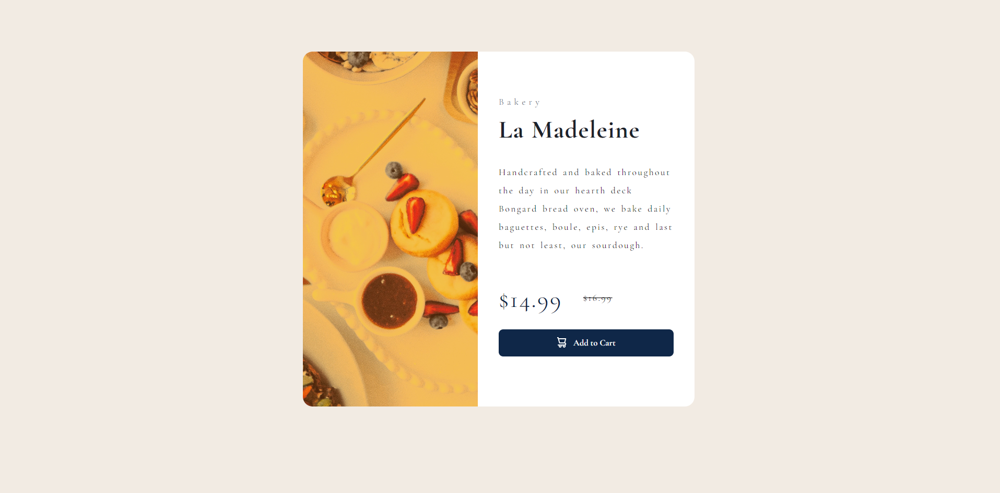

## Table of contents

- [Overview](#overview)
  - [The challenge](#the-challenge)
  - [Screenshot](#screenshot)
  - [Links](#links)
- [My process](#my-process)
  - [Built with](#built-with)
  - [Notes](#notes)
  - [Useful resources](#useful-resources)
- [Author](#author)

## Overview
  Created a product card to be used as template for each new product added to site.
  Created responsive design.

### The challenge

Users should be able to:
- View the optimal layout depending on their device's screen size
- See hover and focus states for interactive elements

### Screenshot

Mobile Screenshot



Desktop Screenshot



### Links

- Solution URL: [Github](https://github.com/SteveNoyes/productPreviewCardComponent)
- Live Site URL: - [GitHub Pages](https://stevenoyes.github.io/productPreviewCardComponent/)

## My process

### Built with

- HTML5 with Emmet
- CSS 
- Flexbox
- Mobile-first workflow
- VSCode
- Google

### Notes

vertical-align: middle; 
It took a long time to find out how to center text next
to text. 

```html
<div class="prices">
  <p>
    <span class="current-price">$149.99</span>
    <span class="old-price">$169.99</span>
  </p>
</div>
```
```css
.current-price {
  font-size: 2.3rem;
  margin-right: 2rem;
  vertical-align: middle;
}
```

Changing image on media query

```html
  
```
```css
  .perfume-image {
    content:url('./img/image-product-desktop.jpg');
  }
```

### Useful resources

- [Reset CSS](https://meyerweb.com/eric/tools/css/reset/) - I use this for most projects to start with a 'clean' area to build.  

- [Text & Word Spacing](https://www.w3schools.com/css/css_text_spacing.asp) - Still didn't get this pixel perfect to my spec. but I think it works.

- [Changing Image at Media Query](https://stackoverflow.com/questions/2182716/is-it-possible-to-set-the-equivalent-of-a-src-attribute-of-an-img-tag-in-css) - Changing at media query was something I went back and forth on. I ended up copying everything and remaking it desktop first and then merged the two. 

## Author

- Website - [Steven Noyes](https://www.stevenmnoyes.com)
- LinkedIn - [Steven Noyes](https://www.linkedin.com/in/steven-noyes/)